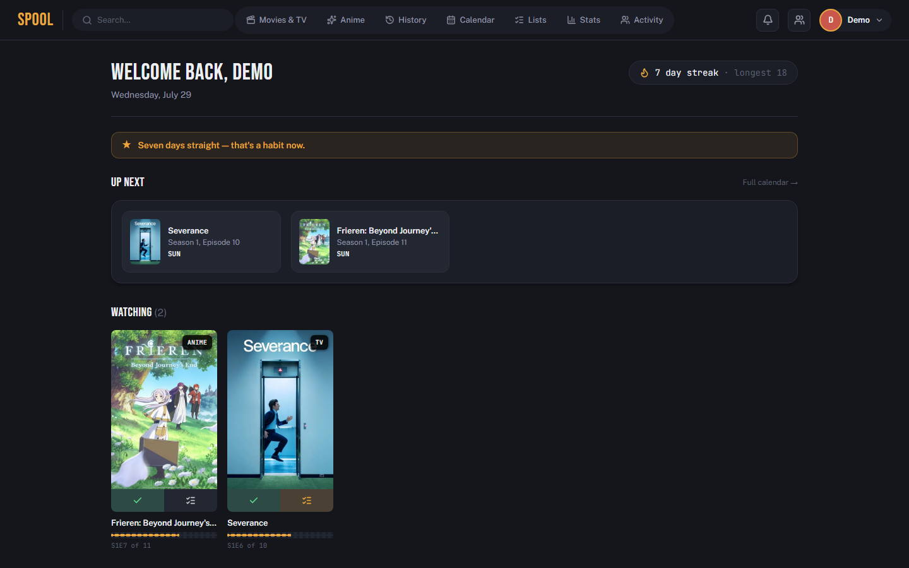
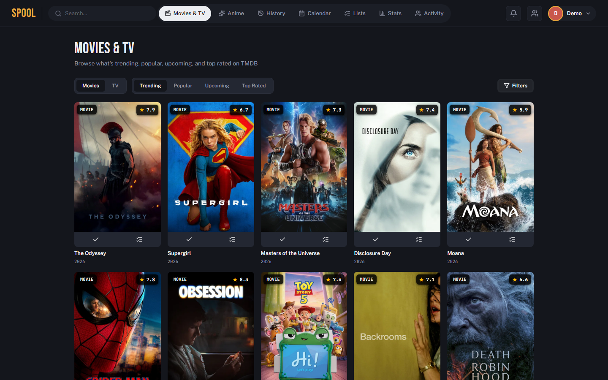
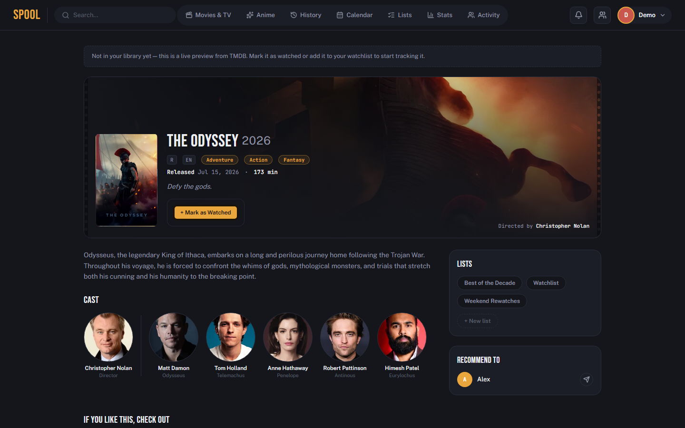
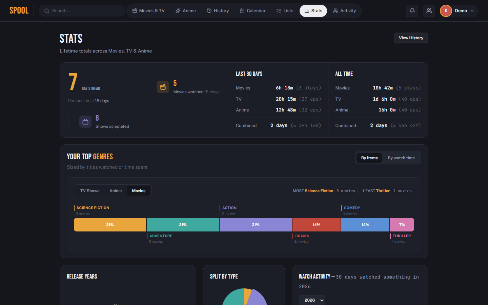
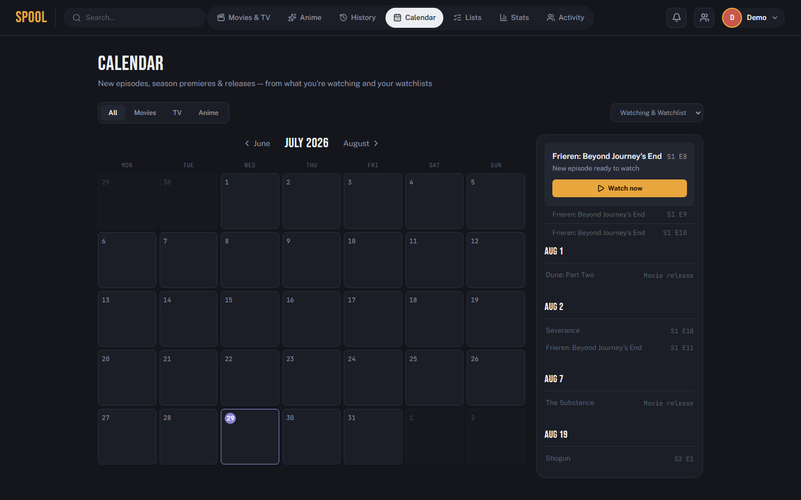

<p align="center">
  
</p>

<p align="center">
  <a href="https://github.com/aljaz-h/spool-tracker/actions/workflows/docker-publish.yml"></a>
  
  
</p>

<p align="center">
  Track what your household watches — movies, TV, and anime — on your own
  server, not someone else's. A self-hosted Trakt/Simkl/Yamtrack
  alternative: Django + Postgres + Redis/Celery, server-rendered with HTMX,
  shipped as a five-container Docker Compose stack you can be running in
  under five minutes.
</p>

## Contents

- [Screenshots](#screenshots)
- [Features](#features)
- [Quick start](#quick-start-docker-compose)
- [Deploying without cloning the repo](#deploying-without-cloning-the-repo-pre-built-image)
- [Configuration reference](#configuration-reference)
- [Posters](#posters)
- [Connecting Trakt / Simkl](#connecting-trakt--simkl)
- [Importing a CSV](#importing-a-csv)
- [Updating](#updating)
- [Backups](#backups)
- [Known limitations](#known-limitations)
- [Local development](#local-development-without-docker)
- [Contributing](#contributing)

## Screenshots

Every screenshot below is a real render of the app against seeded demo
data (`manage.py seed_demo`) — nothing mocked up.

|  |  |
|---|---|
|  Dashboard — streak, up next, watching, watchlist |  Movies & TV — trending/popular/upcoming/top rated, live from TMDB |
|  Title detail — cast, lists, recommend-to-a-housemate |  Stats — streaks, genre breakdown, watch time |

<p align="center"><br>Calendar — episodes, season premieres, and movie releases from what you're watching and your watchlists</p>

A household member can each get their own profile, watch history, lists,
and stats on one instance. History can be logged manually, imported from
a CSV export, or synced automatically from a connected Trakt or Simkl
account.

## Features

- Dashboard: continue watching, up next, recently added to lists, quick stats
- Movies & TV / Anime library views with Watching / Watchlist / History tabs
- Full watch history with filters, pagination, and per-item removal
- Calendar of upcoming episodes/season premieres/movie releases, synced nightly from TMDB for anything you're watching, have watchlisted, or have watch history for
- Shared and private lists (shared lists are creator-only for edit/delete)
- Stats: watch streaks, genre breakdown, year breakdown, activity heatmap
- Activity feed across profiles (only shown once a second profile exists)
- CSV import with column-mapping and a preview-before-commit step
- Trakt / Simkl OAuth connect + a daily background sync job

## Quick start (Docker Compose)

This is the whole install — there's no separate app-server setup.

```bash
git clone https://github.com/aljaz-h/spool-tracker.git
cd spool-tracker
```

**Fastest path** — `setup.sh` (Linux/Mac) or `setup.ps1` (Windows) writes a
working `.env` for you (random `DJANGO_SECRET_KEY`/`DB_PASSWORD`, prompts
for the hostname you'll browse Spool through) and brings the stack up:

```bash
./setup.sh
```
```powershell
.\setup.ps1
```

It's safe to re-run — it never overwrites an existing `.env`. Skip ahead to
[First login](#first-login) once it finishes.

**Or configure manually:**

```bash
cp .env.example .env
```

Edit `.env`:
- Set `DJANGO_SECRET_KEY` to a random string.
- Set `DB_PASSWORD` (and match it inside `DATABASE_URL`).
- Set `DJANGO_ALLOWED_HOSTS` to the hostname(s)/IP you'll access Spool
  through (e.g. `DJANGO_ALLOWED_HOSTS=spool.example.com` or your VPS's IP).
- If you're serving over HTTPS behind a reverse proxy, set
  `DJANGO_CSRF_TRUSTED_ORIGINS=https://spool.example.com`.
- Set `ADMIN_USERNAME` / `ADMIN_PASSWORD` / `ADMIN_DISPLAY_NAME` — the web
  service creates this account automatically on first boot (see
  [First login](#first-login) below).

Then:

```bash
docker compose up -d --build
```

This builds the image, starts Postgres/Redis, runs migrations, bootstraps
the admin account, and starts the app, worker, and scheduler. Check
`docker compose ps` — all five services (`db`, `redis`, `web`, `worker`,
`scheduler`) should report healthy/running within about a minute, and
`curl http://localhost:8000/healthz` (or whatever `WEB_PORT` you set) should
return `ok`. `/healthz` actually probes the database and Redis connections,
so a non-`ok` response means one of them is genuinely unreachable, not just
that the process hasn't started yet.

### First login

Log in with the `ADMIN_USERNAME`/`ADMIN_PASSWORD` you set in `.env`. This
account is created automatically the first time the `web` service starts
with no profile yet in the database — it's idempotent, so it's safe to
leave in `docker compose`'s startup command permanently; it no-ops on every
restart once a profile exists.

If you'd rather not put a real password in `.env` at all, leave
`ADMIN_PASSWORD` blank and create the account yourself instead:

```bash
docker compose exec web python manage.py createsuperuser
docker compose exec web python manage.py shell -c "
from django.contrib.auth.models import User
from tracker.models import Profile
Profile.objects.create(user=User.objects.get(username='<the username you just created>'), display_name='<display name>')
"
```

Additional household members can be added afterward from Settings & Import →
Profiles → "+ Add profile", no shell access needed.

## Deploying without cloning the repo (pre-built image)

If you're adding Spool to a host that already runs other Docker Compose
stacks — e.g. behind an existing Nginx Proxy Manager, Traefik, or
nginx-proxy setup — you don't need the repo at all. Every push to `master`
publishes a ready-to-run image to `ghcr.io/aljaz-h/spool-tracker:latest`
via GitHub Actions (`.github/workflows/docker-publish.yml`), so a new
folder just needs two files:

```bash
mkdir spool && cd spool
curl -o docker-compose.yml https://raw.githubusercontent.com/aljaz-h/spool-tracker/master/docker-compose.prod.yml
curl -o .env https://raw.githubusercontent.com/aljaz-h/spool-tracker/master/.env.example
```

Edit `.env` as described above, then in `docker-compose.yml`:

- If you're running behind a containerized reverse proxy on a shared
  Docker network (Nginx Proxy Manager, Traefik, nginx-proxy), replace
  `CHANGE_ME_TO_YOUR_NPM_NETWORK_NAME` under `networks: proxy:` with that
  network's actual name — find it with
  `docker inspect <your-proxy-container> --format '{{json .NetworkSettings.Networks}}'`
  or `docker network ls`. In your proxy's UI/config, point it at
  `spool-web:8000` (container name : internal port — not the host port).
- If you'd rather reach Spool directly on a host port instead (no
  containerized proxy in the mix), uncomment the `ports:` line under the
  `web` service and remove the `networks:` block instead.

Then:

```bash
docker compose up -d
```

No Dockerfile, no Node/npm, no build step on the VPS — just pulls the
published image.

**GHCR image visibility:** the first time the workflow runs, the package
it creates may default to private, which means `docker compose up -d`
will fail to pull with an auth error. Go to the repo on GitHub → the
"Packages" link in the right sidebar → the `spool-tracker` package →
Package settings → change visibility to Public (there's no secret code in
the image, so this is safe). Alternatively, keep it private and
`docker login ghcr.io` on the VPS with a personal access token that has
`read:packages` scope.

## Configuration reference

All configuration is environment variables — see `.env.example` for the
full list with inline comments. The ones you're most likely to touch:

| Variable | Purpose |
|---|---|
| `WEB_PORT` | Host port the app is published on |
| `DJANGO_SECRET_KEY` | Required, no safe default — generate a random string |
| `DJANGO_ALLOWED_HOSTS` | Must include whatever hostname/IP you browse to |
| `DJANGO_CSRF_TRUSTED_ORIGINS` | Required if serving over HTTPS via a reverse proxy |
| `DB_PASSWORD` / `DATABASE_URL` | Must agree with each other |
| `ADMIN_USERNAME` / `ADMIN_PASSWORD` / `ADMIN_DISPLAY_NAME` | First-run bootstrap account, see above |
| `TRAKT_CLIENT_ID` / `TRAKT_CLIENT_SECRET` | Optional, enables Trakt import |
| `SIMKL_CLIENT_ID` / `SIMKL_CLIENT_SECRET` | Optional, enables Simkl import |
| `TMDB_API_KEY` | Optional, enables poster lookup (see below) |
| `TIME_ZONE` | Used for scheduling and display |

## Posters

Trakt's API doesn't serve poster images at all, and CSV exports never do
either, so titles created via Trakt/Simkl sync or CSV import get a
best-effort poster looked up from TMDB at creation time — set
`TMDB_API_KEY` (a free v3 API key from themoviedb.org) in `.env` and
restart `web`/`worker` for this to take effect. It's matched by title +
year search, so an unusual title or a wrong year in the source data can
occasionally miss; titles with no match just keep the gradient-placeholder
fallback rather than erroring.

If you connected Trakt/Simkl (or ran a CSV import) *before* setting
`TMDB_API_KEY`, those titles were created without a poster and won't
retroactively get one — backfill them once the key's in place:

```bash
docker compose exec web python manage.py backfill_posters
```

This looks up every title that currently has no `poster_url`, so it's
safe to re-run any time (already-illustrated titles are skipped).

## Connecting Trakt / Simkl

1. Register an application with the provider:
   - Trakt: create an app at Trakt's API settings page.
   - Simkl: create an app at Simkl's developer settings page.
2. Set the app's redirect URI to exactly what Spool will send — scheme,
   host, port, and trailing slash all have to match character-for-character,
   since OAuth2 redirect URIs are matched exactly, not just by origin:
   - **Running behind a reverse proxy with a real domain** (the
     `docker-compose.prod.yml` / Nginx Proxy Manager setup):
     `https://<your-domain>/import/trakt/callback/` (or `/import/simkl/callback/`
     for Simkl). This requires `DJANGO_ALLOWED_HOSTS` to include that domain
     and `DJANGO_CSRF_TRUSTED_ORIGINS=https://<your-domain>` in `.env` — see
     [Configuration reference](#configuration-reference). Spool trusts the
     proxy's `X-Forwarded-Proto` header to know the original request was
     HTTPS even though the proxy forwards to it over plain HTTP internally;
     without that, it would generate an `http://` redirect_uri that won't
     match what you registered.
   - **No reverse proxy, accessing directly by host:port**:
     `http://<your-host>:<WEB_PORT>/import/trakt/callback/`. `localhost` and
     `127.0.0.1` are different strings to the provider even though they're
     the same machine — use whichever one you'll actually browse Spool
     through, consistently.
3. Put the client ID/secret in `.env` and restart the web service:
   `docker compose up -d --force-recreate web`
4. Settings & Import → Connect. A daily background sync (04:00 server time)
   keeps a connected account's history up to date afterward; connecting also
   triggers an immediate sync.

**Caveat:** the OAuth flow itself (authorization redirect, token exchange)
follows each provider's documented API shape, but the history-sync response
parsing — especially Simkl's — was written against documentation rather
than a live account, since this project was built without real developer
credentials to test against. Do a small test sync first and spot-check a
few titles/episodes before trusting a full history import.

## Importing a CSV

Settings & Import → CSV file. Works with Trakt's or Simkl's own CSV export,
or a generic one — headers are matched case-insensitively with common
aliases (`title`/`name`, `type`/`media_type`, `date`/`watched_date`, etc.).
Upload takes you to a preview: you can correct any column the auto-detection
guessed wrong before committing. Rows that fail to parse (bad date, unknown
media type, missing title) are skipped individually and listed in the
result summary — one bad row doesn't abort the whole file. Titles are
matched by (name, year, type), so re-importing the same file, or importing
a title already pulled in via Trakt/Simkl sync, won't create duplicates as
long as the name/year match exactly.

## Updating

```bash
git pull
docker compose up -d --build
```

Migrations run automatically as part of the `web` service's startup
command — no separate migrate step needed.

## Backups

- `db_data` (Postgres) is the one that matters — it holds all watch
  history, titles, lists, and accounts.
- `media_data` currently only holds transient CSV-import temp files that
  are deleted right after each import completes; nothing long-lived lives
  there yet.
- `redis_data` is cache/broker state, safe to lose.

```bash
docker compose exec db pg_dump -U spool spool > backup.sql
```

## Known limitations

- **Simkl history sync is unverified against a live account** — see the
  caveat above.
- **CSV import** has no TMDB/IMDB-based matching — same-title-different-
  spelling across a CSV import and a Trakt/Simkl sync can create a
  duplicate Title.
- **No light theme** — the Settings → Appearance light-mode swatch is
  decorative; only the dark theme is implemented.
- **Poster matching is title+year search, not ID-based** — an unusual
  title, an off-by-one release year, or a title TMDB just doesn't have
  will silently keep the gradient-placeholder fallback rather than error.
- **Single Django project, no multi-tenancy** — profiles share one
  instance/database by design (this is a household tracker, not a
  multi-user SaaS); anyone with a login can see every shared list and the
  Activity feed.

## Local development (without Docker)

```bash
python -m venv .venv && source .venv/Scripts/activate   # or .venv/bin/activate on Linux/Mac
pip install -r requirements.txt
npm install
npx @tailwindcss/cli -i ./static/src/app.css -o ./static/dist/app.css --watch   # separate terminal
cp .env.example .env   # DATABASE_URL can be left unset to fall back to sqlite
python manage.py migrate
python manage.py bootstrap_admin   # or createsuperuser, see above
python manage.py runserver
```

Celery/Redis-dependent features (Trakt/Simkl sync) won't run without a
Redis instance and a `celery -A spool worker` process alongside the dev
server; everything else works against just `runserver` + sqlite.

Want the app populated with realistic demo data instead of an empty
account (handy for trying features out, or for taking your own
screenshots)? `python manage.py seed_demo` — refuses to touch anything
outside `DEBUG=True` on purpose, see its `--help`.

## Contributing

Bug reports, feature requests, and PRs are welcome — see
[CONTRIBUTING.md](CONTRIBUTING.md) for dev setup and expectations, and
[CODE_OF_CONDUCT.md](CODE_OF_CONDUCT.md) for community guidelines.
